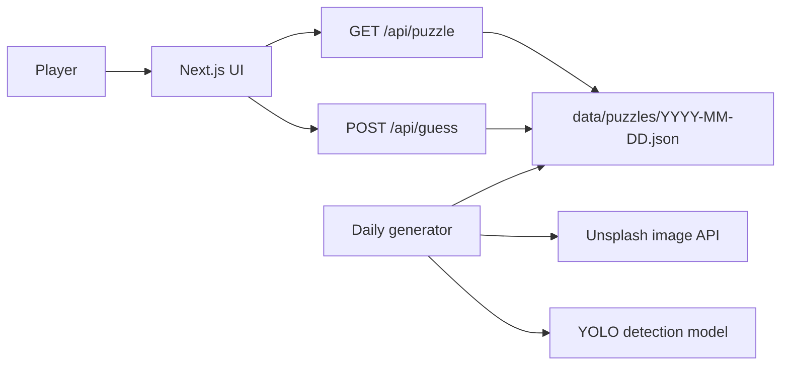
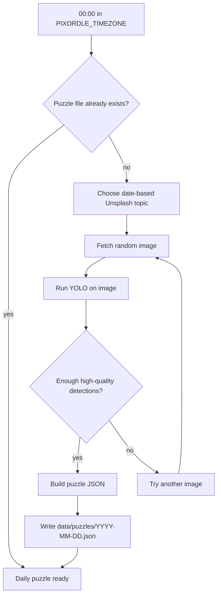
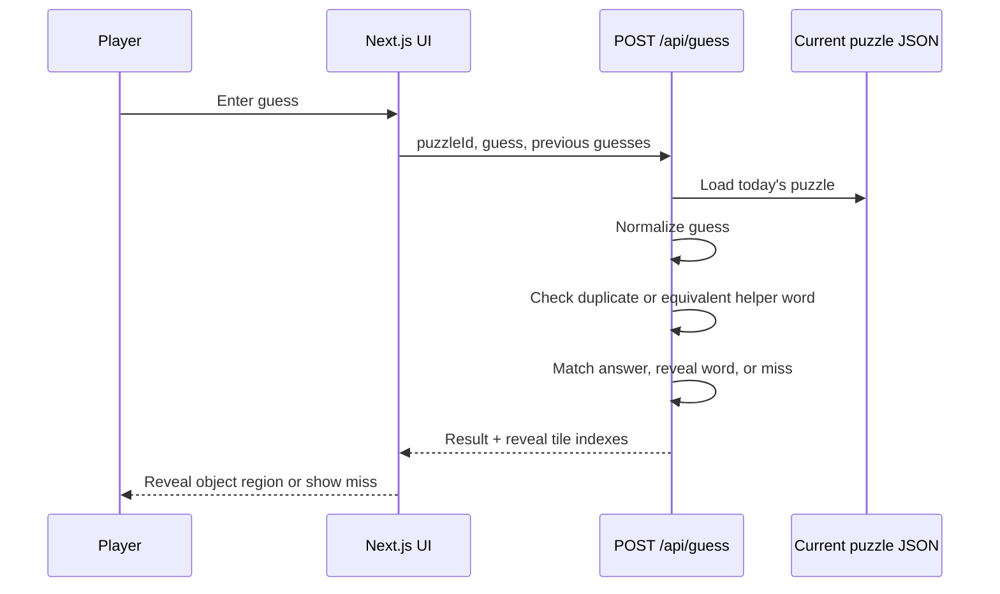

# Pixordle

Pixordle is a daily image-word puzzle built with Next.js. Each day, the app selects a random image, detects objects in that image, and turns those detections into guessable words. Players guess visible objects to reveal matching regions of the hidden image, then solve the puzzle by naming the main image word.

The experience is similar to Wordle in cadence and vocabulary matching, but the puzzle board is visual: every correct object guess uncovers the exact area where that object appears.

## Product Behavior

- A new daily puzzle is generated at `00:00` in `PIXORDLE_TIMEZONE`.
- The source image is selected from Unsplash.
- YOLO object detection identifies objects in the selected image.
- Each detected object stores its label, confidence score, source-image bounding box, aliases, and board reveal region.
- The strongest non-bland detection becomes the main answer when possible.
- Other high-confidence detections become reveal words, including common objects that may be too bland for the final answer.
- Close helper words are accepted, such as plurals and common synonyms.
- Guessing a reveal word uncovers that object's image region.
- Guessing the main answer solves the puzzle and reveals the full image.

## System Overview



## Daily Puzzle Generation

The generator creates one stable puzzle file per date. Once a file exists, it is reused for the rest of that day unless generation is explicitly forced.



Generation steps:

1. Resolve today's date in `PIXORDLE_TIMEZONE`.
2. Pick the first topic deterministically from `UNSPLASH_TOPICS`, then rotate through the topic pool on retries.
3. Fetch a random squarish Unsplash image for the current topic.
4. Download the selected image.
5. Run YOLO using `YOLO_MODEL`.
6. Deduplicate detections by label, keeping the highest-confidence box.
7. Reject low-confidence labels.
8. Choose the main answer, preferring non-bland labels that are both confident and visually significant.
9. Convert detection bounding boxes into Pixordle board reveal regions.
10. Attach aliases and helper words, dropping aliases that are ambiguous within the puzzle.
11. Save the final puzzle JSON.

## Guess Flow



Guess outcomes:

- `answer`: the guess matches the main image word or one of its aliases. The full image is revealed.
- `related`: the guess matches a detected object or helper alias. Only that object's region is revealed.
- `miss`: the guess does not match the answer or any reveal word.
- `duplicate`: the guess has already been used, including equivalent helper words.
- `invalid`: the guess is empty or belongs to a stale puzzle.

## Data Model

Daily puzzles live in `data/puzzles/YYYY-MM-DD.json`.

```json
{
  "id": "bicycle-2026-04-23",
  "dateKey": "2026-04-23",
  "title": "Daily Bicycle Puzzle",
  "answer": "bicycle",
  "aliases": ["bike", "cycle", "bicycles"],
  "maxGuesses": 8,
  "boardSize": 420,
  "gridSize": 32,
  "imageUrl": "https://...",
  "imageAlt": "a bicycle parked outdoors",
  "imageSize": {
    "width": 1200,
    "height": 1200
  },
  "words": [
    {
      "guess": "wheel",
      "aliases": ["wheels", "tire", "tyre", "rim"],
      "reveal": [115, 245, 100, 105],
      "confidence": 0.98
    }
  ],
  "detections": [
    {
      "label": "bicycle",
      "aliases": ["bike", "cycle", "bicycles"],
      "confidence": 0.98,
      "bbox": [110, 165, 330, 350]
    }
  ]
}
```

Important fields:

- `answer`: the final word that solves the puzzle.
- `aliases`: accepted helper words for the answer.
- `words`: detected object words that reveal specific image regions.
- `words[].reveal`: board-space rectangle `[x, y, width, height]`.
- `detections[].bbox`: source-image YOLO box `[x1, y1, x2, y2]`.
- `gridSize`: number of mask tiles per row and column.
- `boardSize`: coordinate space used for reveal rectangles.

## Runtime Behavior

The app loads the current puzzle through `GET /api/puzzle`. The API uses `PIXORDLE_TIMEZONE` to decide which date is active and returns the next reset time so the browser can refresh at the correct midnight boundary.

If today's generated puzzle file is missing, the app falls back to `data/puzzles/default.json`. If `AUTO_GENERATE_DAILY=true`, the API also attempts to generate today's puzzle on first request. Failed API-triggered generation is rate-limited briefly so repeated page loads still serve the fallback quickly.

## Core Files

- `app/page.tsx`: client game UI, tile reveal state, guess history, reset timing.
- `app/api/puzzle/route.ts`: public puzzle endpoint.
- `app/api/guess/route.ts`: guess validation and reveal response endpoint.
- `lib/puzzle.ts`: shared puzzle types, normalization, matching, tile reveal math.
- `lib/puzzle-store.ts`: puzzle loading, fallback behavior, daily timing.
- `scripts/generate-daily-puzzle.py`: Unsplash + YOLO puzzle generator.
- `scripts/run-daily-generator.py`: long-running midnight generator daemon.
- `data/puzzles/default.json`: fallback puzzle used when no daily file exists.

## Environment

Create `.env` from `.env.example`.

| Variable | Purpose |
| --- | --- |
| `UNSPLASH_ACCESS_KEY` | Required for fetching source images. |
| `PIXORDLE_TIMEZONE` | Timezone used for daily date boundaries. |
| `AUTO_GENERATE_DAILY` | Enables API-level generation if today's puzzle is missing. |
| `YOLO_MODEL` | YOLO model file, for example `yolov8m.pt`. |
| `YOLO_CONFIDENCE` | Minimum detection confidence passed to YOLO prediction. |
| `YOLO_MIN_WORD_CONFIDENCE` | Minimum confidence for reveal word candidates. |
| `YOLO_MIN_ANSWER_CONFIDENCE` | Minimum confidence required for the main answer. Default: `0.45`. |
| `YOLO_MIN_ANSWER_AREA` | Minimum fraction of image area required for the main answer bounding box. Default: `0.015`. |
| `YOLO_MIN_REVEAL_AREA` | Minimum fraction of image area required for reveal word bounding boxes. Default: `0.003`. |
| `PUZZLE_MIN_REVEAL_WORDS` | Required number of reveal words for a valid puzzle. Default: `3`. |
| `PUZZLE_MAX_REVEAL_WORDS` | Maximum reveal words stored in a puzzle. |
| `PUZZLE_MAX_IMAGE_ATTEMPTS` | Number of Unsplash images to try before failing generation. Default: `25`. |
| `PUZZLE_BLAND_LABELS` | Labels that are avoided as the main answer when a stronger answer exists. They can still be reveal words. |
| `PUZZLE_BOARD_SIZE` | Reveal coordinate system size. |
| `PUZZLE_GRID_SIZE` | Number of mask tiles per axis. |
| `PUZZLE_MAX_GUESSES` | Guess limit per puzzle. |
| `UNSPLASH_TOPICS` | Comma-separated topic pool for daily image selection. |

## Production Scheduling

Recommended production setup is an external scheduler that runs the daily generator at midnight:

```bash
npm run generate:daily
```

The repo also includes a daemon process:

```bash
npm run generate:daemon
```

The daemon waits until the next midnight in `PIXORDLE_TIMEZONE`, generates the new puzzle, then repeats daily.

## API Reference

### `GET /api/puzzle`

Returns the public puzzle payload:

- puzzle identity and date metadata
- next reset time
- board geometry
- reveal word labels
- image URL and alt text

The answer, aliases, raw detections, and reveal rectangles are not exposed through this endpoint.

### `POST /api/guess`

Validates a guess against the current puzzle.

Request body:

```json
{
  "puzzleId": "bicycle-2026-04-23",
  "guess": "wheel",
  "previousGuesses": ["bike"],
  "guessesUsed": 1
}
```

Response includes:

- `kind`: `answer`, `related`, `miss`, `duplicate`, or `invalid`
- `message`: user-facing result text
- `reveal`: tile indexes to uncover for related guesses
- `solved`: `true` when the main answer is guessed
- `exhausted`: `true` when the guess limit is reached

## Developer Commands

Install JavaScript dependencies:

```bash
npm install
```

Install Python dependencies:

```bash
python3 -m pip install -r requirements.txt
```

Run the app locally:

```bash
npm run dev
```

Open `http://localhost:3000`.

Type-check the app:

```bash
npm run typecheck
```

Build for production:

```bash
npm run build
```

Generate today's puzzle manually:

```bash
npm run generate:daily
```

Generate a specific date:

```bash
npm run generate:daily -- --date=2026-04-22
```

Replace an existing generated puzzle:

```bash
npm run generate:daily -- --date=2026-04-22 --force
```

Run the midnight generator daemon:

```bash
npm run generate:daemon
```
